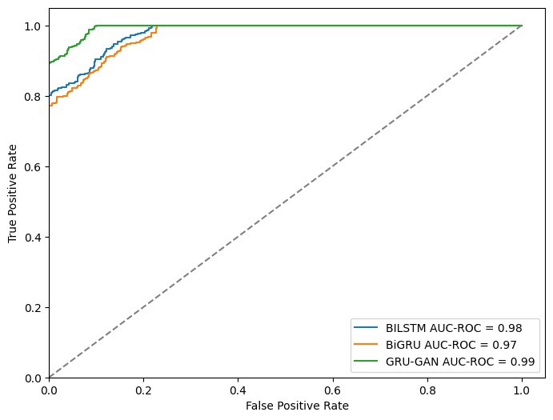

# Bicycle Sales Analysis
# Project Title
The name of the project and a brief description of the main goal and purpose of the project.was created using a template. Select each section of the document for more information.

# Demo Link
If you have a working demo of the project, provide the link so that readers can see your project in action.

</img>
# Table of Contents (optional)
If the project has sections, a table of contents can be generated from the section titles. In this raw text example, the section titles are preceded by the ## characters.

# Business Understanding
Your description of the goals and purpose of the project. In this section, you should explain a little about what you wanted to accomplish, why you selected this analysis project, and any challenges you faced while working through the project.

# Data Understanding
Explain your data sources and why you chose the particular data sets that you did. You can also discuss additional enhancements or analysis that you want to perform in the future.
Screenshots of Visualizations/Results
Examples of the process or outputs. In analytics, these can be images of visualizations.
# Technologies
List all of the technologies you used to complete the project, to show your proficiency with these tools.
# Setup
Instructions on how to set up or install the environment and any dependencies that are required. This section can also include usage instructions for readers who want to duplicate your results.
# Approach
For analytics projects, this section describes the process and the types of analysis utilized to obtain the data, prepare and clean it, and to test the outcomes.
# Status
The current status of the project. In most cases, you will be putting information into the repository while you are working on the project, so the status will be “in process” and, later, “complete/released”. If there are multiple versions of your project, you can indicate the version here, as well.
# Credits
List of individuals or organizations that contributed or provided assistance to you while you created the project. You can also list sites that provided inspiration or feedback.

